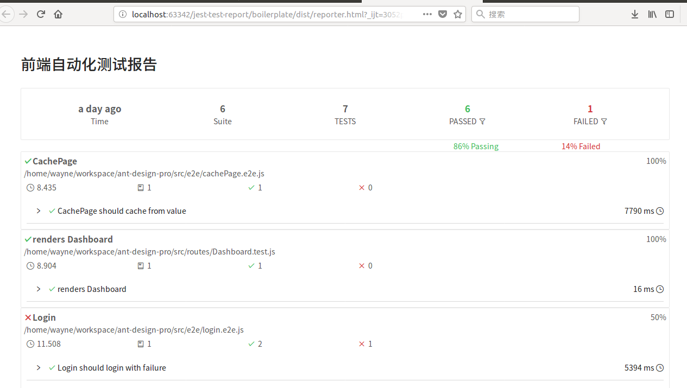

# jest-report


> Generate Jest test results reporter into your CI builds



## Getting Started

Install it via npm:

```shell
npm install jest-report
```

And include in your project:


The reporter integrates with Jest in form of a [testResultsProcessor](https://facebook.github.io/jest/docs/api.html#testresultsprocessor-string). Put this into your projects `package.json`:

```
"jest": {
    "testResultsProcessor": "jest-report"
}
```
Then, just use Jest as usual, e.g. put this in your `package.json`

```
"scripts": {
    "test": "jest"
}
```
Then, simply run `npm test`, and open `./dist/testReport/reporter.html` is HTML reporter
## License

MIT
